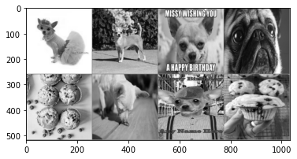
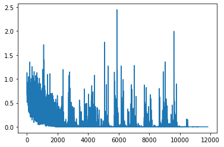

```python
import sys
import torch
import torchvision
import torchvision.transforms as transforms
import torch.nn as nn
import torch.nn.functional as F
from torch.utils.data import DataLoader
import matplotlib.pyplot as plt
import numpy as np
import seaborn as sns
from sklearn.metrics import accuracy_score
```

    C:\Users\jorge\anaconda3\envs\pytorch\lib\site-packages\tqdm\auto.py:22: TqdmWarning: IProgress not found. Please update jupyter and ipywidgets. See https://ipywidgets.readthedocs.io/en/stable/user_install.html
      from .autonotebook import tqdm as notebook_tqdm
    


```python
# load dataset folder
DatasetFolder = 'C:/Users/jorge/Desktop/github/img_processing/dog_muffin'
TrainData = DatasetFolder + '/train'
TestData = DatasetFolder + '/test'

```


```python
# image transforms 
transform = transforms.Compose([
    transforms.Resize((256, 256)),
    transforms.Grayscale(),
    transforms.ToTensor(),
    transforms.Normalize((0.5, ), (0.5, ))
    ])

#batch size, data sets and loaders
batch_size = 8

trainset = torchvision.datasets.ImageFolder(root=TrainData, transform = transform)
testset = torchvision.datasets.ImageFolder(root=TestData, transform = transform)

trainloader = DataLoader(trainset, batch_size= batch_size, shuffle = True)
testloader = DataLoader(testset, batch_size=batch_size, shuffle = True)
```


```python
def imshow(img):
    img = img / 2 + 0.5     # unnormalize
    npimg = img.numpy()
    plt.imshow(np.transpose(npimg, (1, 2, 0)))
    plt.show()
    
dataiter = iter(trainloader)
images, labels = dataiter.next()
imshow(torchvision.utils.make_grid(images, nrow=4))
```


    

    


```python
class binaryClassification(nn.Module):
    def __init__(self) -> None:
        super().__init__()
        self.conv1 = nn.Conv2d(1, 6, 3) 
        self.pool = nn.MaxPool2d(2,2) 
        self.conv2 = nn.Conv2d(6, 16, 3) 
        self.fc1 = nn.Linear(16 * 62 * 62, 128) 
        self.fc2 = nn.Linear(128, 64)
        self.fc3 = nn.Linear(64, 1)
        self.sigmoid = nn.Sigmoid()
        self.relu = nn.ReLU
        
    
    def forward(self, x):
        x = self.conv1(x) 
        x = F.relu(x)
        x = self.pool(x) 
        x = self.conv2(x) 
        x = F.relu(x)
        x = self.pool(x) 

        x = torch.flatten(x, 1) 
        x = self.fc1(x)
        x = F.relu(x)
        x = self.fc2(x) 
        x = F.relu(x)
        x = self.fc3(x) 

        x = self.sigmoid(x)

        return x
```


```python
model = binaryClassification()      

lr = 0.001

loss_fn = nn.BCELoss()
optimizer = torch.optim.AdamW(model.parameters(), lr=lr)
losses = []
print(model)
```

    binaryClassification(
      (conv1): Conv2d(1, 6, kernel_size=(3, 3), stride=(1, 1))
      (pool): MaxPool2d(kernel_size=2, stride=2, padding=0, dilation=1, ceil_mode=False)
      (conv2): Conv2d(6, 16, kernel_size=(3, 3), stride=(1, 1))
      (fc1): Linear(in_features=61504, out_features=128, bias=True)
      (fc2): Linear(in_features=128, out_features=64, bias=True)
      (fc3): Linear(in_features=64, out_features=1, bias=True)
      (sigmoid): Sigmoid()
    )
    


```python
NUM_EPOCHS = 20
for epoch in range(NUM_EPOCHS):
    for i, data in enumerate(trainloader, 0):
        inputs, labels = data
        # zero gradients
        optimizer.zero_grad()

        # forward pass
        outputs = model(inputs)

        # calc losses
        loss = loss_fn(outputs, labels.reshape(-1, 1).float())

        # backward pass
        loss.backward()
        
        # update weights
        optimizer.step()
        losses.append(float(loss.data.detach().numpy()))  
        if i % 100 == 0:
            sys.stdout.write(f'Step {i+1}/{len(trainloader)},'f'Loss: {loss.item():.4f}\n')
    sys.stdout.write(f'Epoch {epoch}/{NUM_EPOCHS},'f'Loss: {loss.item():.7f}\n')
```

    Step 1/592,Loss: 0.6690
    Step 101/592,Loss: 0.5535
    Step 201/592,Loss: 0.3730
    Step 301/592,Loss: 0.6869
    Step 401/592,Loss: 0.3103
    Step 501/592,Loss: 0.2633
    Epoch 0/20,Loss: 0.6528030
    Step 1/592,Loss: 0.5287
    Step 101/592,Loss: 0.1278
    Step 201/592,Loss: 0.5441
    Step 301/592,Loss: 0.5935
    Step 401/592,Loss: 0.3113
    Step 501/592,Loss: 1.7150
    Epoch 1/20,Loss: 0.5130351
    Step 1/592,Loss: 0.3846
    Step 101/592,Loss: 0.0468
    Step 201/592,Loss: 0.0244
    Step 301/592,Loss: 0.0795
    Step 401/592,Loss: 0.0528
    Step 501/592,Loss: 0.2172
    Epoch 2/20,Loss: 0.1240231
    Step 1/592,Loss: 0.0408
    Step 101/592,Loss: 0.0282
    Step 201/592,Loss: 0.0029
    Step 301/592,Loss: 0.1024
    Step 401/592,Loss: 0.0680
    Step 501/592,Loss: 0.0008
    Epoch 3/20,Loss: 0.0229374
    Step 1/592,Loss: 0.0053
    Step 101/592,Loss: 0.0061
    Step 201/592,Loss: 0.0496
    Step 301/592,Loss: 0.0002
    Step 401/592,Loss: 0.0064
    Step 501/592,Loss: 0.0035
    Epoch 4/20,Loss: 0.3824308
    Step 1/592,Loss: 0.0016
    Step 101/592,Loss: 0.0001
    Step 201/592,Loss: 0.0000
    Step 301/592,Loss: 0.0000
    Step 401/592,Loss: 0.0007
    Step 501/592,Loss: 0.0295
    Epoch 5/20,Loss: 0.0013492
    Step 1/592,Loss: 0.3169
    Step 101/592,Loss: 0.0002
    Step 201/592,Loss: 0.0009
    Step 301/592,Loss: 0.0013
    Step 401/592,Loss: 0.0049
    Step 501/592,Loss: 0.0012
    Epoch 6/20,Loss: 0.0010372
    Step 1/592,Loss: 0.0450
    Step 101/592,Loss: 0.0116
    Step 201/592,Loss: 0.0080
    Step 301/592,Loss: 0.0043
    Step 401/592,Loss: 0.0003
    Step 501/592,Loss: 0.0023
    Epoch 7/20,Loss: 0.0000260
    Step 1/592,Loss: 0.0023
    Step 101/592,Loss: 0.0000
    Step 201/592,Loss: 0.0026
    Step 301/592,Loss: 0.0000
    Step 401/592,Loss: 0.0003
    Step 501/592,Loss: 0.0001
    Epoch 8/20,Loss: 0.0495595
    Step 1/592,Loss: 0.0184
    Step 101/592,Loss: 0.0002
    Step 201/592,Loss: 0.0001
    Step 301/592,Loss: 0.0000
    Step 401/592,Loss: 0.0032
    Step 501/592,Loss: 0.0051
    Epoch 9/20,Loss: 0.0030602
    Step 1/592,Loss: 0.0048
    Step 101/592,Loss: 0.0037
    Step 201/592,Loss: 0.0042
    Step 301/592,Loss: 0.1187
    Step 401/592,Loss: 0.0184
    Step 501/592,Loss: 0.0005
    Epoch 10/20,Loss: 0.0002081
    Step 1/592,Loss: 0.0002
    Step 101/592,Loss: 0.0014
    Step 201/592,Loss: 0.0001
    Step 301/592,Loss: 0.0167
    Step 401/592,Loss: 0.0029
    Step 501/592,Loss: 0.0011
    Epoch 11/20,Loss: 0.0000647
    Step 1/592,Loss: 0.0059
    Step 101/592,Loss: 0.0002
    Step 201/592,Loss: 0.0000
    Step 301/592,Loss: 0.0001
    Step 401/592,Loss: 0.0001
    Step 501/592,Loss: 0.0000
    Epoch 12/20,Loss: 0.0000324
    Step 1/592,Loss: 0.0108
    Step 101/592,Loss: 0.0001
    Step 201/592,Loss: 0.0040
    Step 301/592,Loss: 0.0005
    Step 401/592,Loss: 0.0002
    Step 501/592,Loss: 0.0005
    Epoch 13/20,Loss: 0.0003202
    Step 1/592,Loss: 0.0002
    Step 101/592,Loss: 0.0007
    Step 201/592,Loss: 0.0000
    Step 301/592,Loss: 0.0001
    Step 401/592,Loss: 0.0000
    Step 501/592,Loss: 0.0000
    Epoch 14/20,Loss: 0.0000144
    Step 1/592,Loss: 0.0002
    Step 101/592,Loss: 0.0835
    Step 201/592,Loss: 0.0002
    Step 301/592,Loss: 0.4377
    Step 401/592,Loss: 0.0000
    Step 501/592,Loss: 0.0074
    Epoch 15/20,Loss: 0.0000018
    Step 1/592,Loss: 0.0036
    Step 101/592,Loss: 0.0008
    Step 201/592,Loss: 0.0180
    Step 301/592,Loss: 0.0002
    Step 401/592,Loss: 0.0002
    Step 501/592,Loss: 0.0001
    Epoch 16/20,Loss: 0.0000045
    Step 1/592,Loss: 0.0001
    Step 101/592,Loss: 0.0003
    Step 201/592,Loss: 0.0001
    Step 301/592,Loss: 0.0000
    Step 401/592,Loss: 0.0001
    Step 501/592,Loss: 0.0000
    Epoch 17/20,Loss: 0.0002171
    Step 1/592,Loss: 0.0002
    Step 101/592,Loss: 0.0000
    Step 201/592,Loss: 0.0004
    Step 301/592,Loss: 0.0000
    Step 401/592,Loss: 0.0000
    Step 501/592,Loss: 0.0000
    Epoch 18/20,Loss: 0.0000005
    Step 1/592,Loss: 0.0000
    Step 101/592,Loss: 0.0000
    Step 201/592,Loss: 0.0000
    Step 301/592,Loss: 0.0000
    Step 401/592,Loss: 0.0000
    Step 501/592,Loss: 0.0000
    Epoch 19/20,Loss: 0.0000015
    


```python
sns.lineplot(x= range(len(losses)), y = losses)
```


    <AxesSubplot:>


    

    


```python
y_test = []
y_test_hat = []
for i, data in enumerate(testloader, 0):
    inputs, y_test_temp = data
    with torch.no_grad():
        y_test_hat_temp = model(inputs).round()
    
    y_test.extend(y_test_temp.numpy())
    y_test_hat.extend(y_test_hat_temp.numpy())


acc = accuracy_score(y_test, y_test_hat)
print(f'Accuracy: {acc*100:.2f} %')


```

    Accuracy: 82.01 %
    


```python
model_path = 'C:/Users/jorge/Desktop/github/img_processing/binaryClass.pth'

torch.save(binaryClassification().state_dict(), model_path)

```


```python
model.eval()
```


    binaryClassification(
      (conv1): Conv2d(1, 6, kernel_size=(3, 3), stride=(1, 1))
      (pool): MaxPool2d(kernel_size=2, stride=2, padding=0, dilation=1, ceil_mode=False)
      (conv2): Conv2d(6, 16, kernel_size=(3, 3), stride=(1, 1))
      (fc1): Linear(in_features=61504, out_features=128, bias=True)
      (fc2): Linear(in_features=128, out_features=64, bias=True)
      (fc3): Linear(in_features=64, out_features=1, bias=True)
      (sigmoid): Sigmoid()
    )


```python

```
